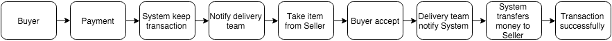
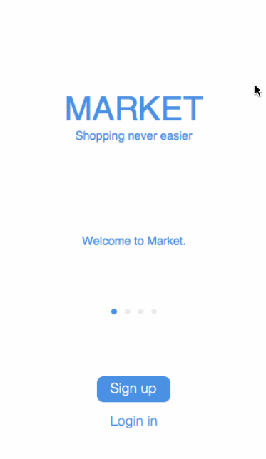

##Market
An iOS Swift application for shopping. People can use this app for selling/buying whatever they want.

### Features

#### Required
- [x] User can login/logout/signup
- [x] User can see a list of posts from:
    - [x] Following sellers
    - [x] User's choice
    - [x] Newest posts
- [x] User can view post detail
- [x] User can see other user's profile and posts
- [x] User can follow each other
- [x] User can submit/edit/delete a post with images (from camera, taken photo), video, price, description, status, location...
- [x] User can vote for posts have a good price/deal
- [x] User can message with each other
- [ ] User can search by hashtag, title, description, people/branches, price, location
- [x] User can receive notifications for: 
    - [x] Messages
    - [x] Saved post content changes
    - [x] Specific keywords
- [x] A Settings page to control Saved list, profile, Following, Notifications hashtag …
    
#### Optional
- [ ] Login Facebook/Twitter
- [ ] User can create account for a branch
- [ ] User can see posts they voted
- [ ] Report posts
- [ ] Post revisions
- [ ] Shipping service
    - The app will support for paying by bank cards, will be a service to do this
    

Our small survey:
https://docs.google.com/forms/d/1wsMt7Bk3--dh_hLzaJecRANQeoRHm7UsOQV9N03SMOA/viewanalytics

### Wireframe Walkthrough

You can also try on browsers: https://invis.io/UQ5735UED
